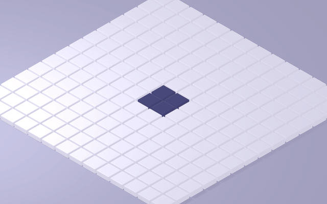
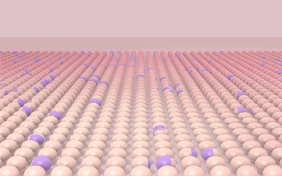
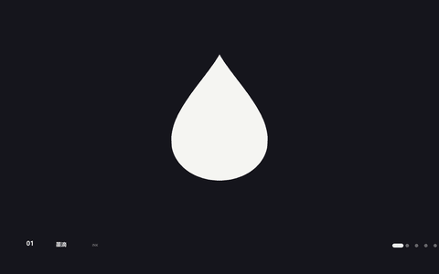
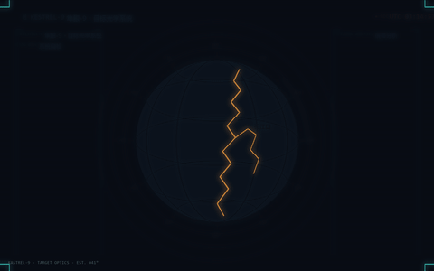

# Procedural Motion · 程序化动效实验室

> 用纯代码复刻经典动效风格 —— 不用 AE、不用手绘板，每一帧都是数学画出来的。
> Recreating classic motion-design styles from scratch with code (PIL · Blender · ffmpeg).

每个风格 = 一份参数化脚本 + 一篇知识文档 + 一段成片。改几个常量重跑一遍，就能出你自己的版本。

## 已完成风格

| # | 风格 | 预览 | 核心技术 | 文档 |
|---|------|------|----------|------|
| 01 | 逐帧手绘 Frame-by-Frame |  | 程序化"线条沸腾" + 一拍二（12fps 绘制 / 24fps 编码） | [README](01-frame-by-frame/README.md) |
| 02 | 等轴 2.5D Isometric |  | Blender 无头 EEVEE + 正交等轴相机 + 波前调度动画 | [README](02-isometric-2.5d/README.md) |
| 03 | 扁平矢量 Flat Vector |  | 缓动函数库 + 动画十二法则（回弹/挤压拉伸/预备动作） | [README](03-flat-vector/README.md) |
| 04 | 线条动画 Line Art |  | 单路径弧长采样 + 描边进度揭示（SVG stroke-dashoffset 的代码版） | [README](04-line-art/README.md) |
| 05 | 3D 渲染 3D Render |  | 软膜高度场：解析波+压坑、法线倾斜、果冻压扁、次表面散射 | [README](05-3d-render/README.md) |
| 06 | 形变动画 Shape Morph |  | 弧长重采样 + 锚点对齐 + 逐点缓动插值（SVG 形状插值） | [README](06-shape-morph/README.md) |
| 07 | 贴纸风科普 Sticker Explainer |  | 超大画布 + 相机运镜裁剪 + 贴纸三层结构 | [README](07-sticker-explainer/README.md) |
| 08 | 赛博朋克 HUD Cyberpunk FUI |  | 辉光 screen 混合 + 参数化线框球 + 确定性噪声数据流 | [README](08-cyberpunk-hud/README.md) |

## 风格 Roadmap（目标 15 种，持续更新）

- [x] 01 逐帧手绘 —— 爆炸循环，线条沸腾，一拍二
- [x] 02 等轴 2.5D —— 马林巴瓷砖，24fps 与 60fps 双版本对比
- [x] 03 扁平矢量 —— 圆点一镜长成太阳，24fps 与 60fps 双版本对比
- [x] 04 线条动画 —— 一笔画：种子 → 城市 → 圆日
- [x] 05 3D 渲染 —— 柔软着陆：气球字 + 铬球句号 + 软膜果冻球海（附运动学波/刚体颗粒两版对比）
- [x] 06 形变动画 —— 一滴墨 → 咖啡 → 日落 → 海鸥，四幕形变
- [x] 07 贴纸风科普 —— 超大画布运镜：一部手机里藏着多少种元素？
- [x] 08 赛博朋克 HUD —— 隼眼-9：开机、搜索、锁定长江口
- [ ] 06 ~ 15 待解锁

## 快速开始

<details>
<summary><b>环境依赖</b>（点开）</summary>

| 依赖 | 用途 | 备注 |
|------|------|------|
| Python 3.10+ | 全部脚本 | 作者用 3.12 |
| Pillow + numpy | 01 / 03 / 04 渲染 | `pip install pillow numpy` |
| ffmpeg（任意 PATH 版本） | PNG 帧 → MP4 / GIF | 编码命令见各文档 |
| Blender 4.5 | 仅 02 | 无头模式 `blender -b`，装了 4.x 大概率能跑 |

</details>

```bash
# 01 逐帧手绘：渲染 48 帧 + 编码
cd 01-frame-by-frame
python make_boom.py all
ffmpeg -y -framerate 12 -i frames/f_%03d.png -c:v libx264 -preset slow -crf 18 -pix_fmt yuv420p -r 24 -movflags +faststart output.mp4

# 02 等轴 2.5D：Blender 无头渲染（秒数帧率可传参），60fps 为例
cd 02-isometric-2.5d
blender -b -P build_isopolis.py -- full 60
ffmpeg -y -framerate 60 -i frames_60/f_%04d.png -c:v libx264 -preset slow -crf 17 -pix_fmt yuv420p -movflags +faststart output_60fps.mp4

# 03 扁平矢量：v2 为 60fps 重制版
cd 03-flat-vector
python make_flat_v2.py all
ffmpeg -y -framerate 60 -i frames2/f_%04d.png -c:v libx264 -preset slow -crf 17 -pix_fmt yuv420p -movflags +faststart output_v2_60fps.mp4

# 04 线条动画
cd 04-line-art
python make_lineart.py all
ffmpeg -y -framerate 60 -i frames/f_%04d.png -c:v libx264 -preset slow -crf 17 -pix_fmt yuv420p -movflags +faststart output.mp4

# 05 3D 渲染（Blender 无头，帧率可传参）
cd 05-3d-render
blender -b -P build_soft.py -- full 60
ffmpeg -y -framerate 60 -i frames_60/f_%04d.png -c:v libx264 -preset slow -crf 17 -pix_fmt yuv420p -movflags +faststart output.mp4
```

## 为什么仓库里没有帧序列？

PNG 帧是中间产物（一个 8 秒 60fps 视频就是 480 张图，几百 MB），**脚本即源代码**，帧随时可重渲。仓库只保留：脚本（<100KB）+ 成片 MP4（可直接在线播放）+ README 预览 GIF。

## 三个设计决策，也是三个知识点

1. **帧率跟着风格走**：UI/扁平动效 60fps 起步（v1 的 24fps 版就"不丝滑"，对比视频在 03 目录）；逐帧手绘反而要 12fps 一拍二，高帧率会杀死手绘味；3D 渲染 24~60 皆可。
2. **动画的灵魂是时间曲线**：同样两个关键帧，linear 和 easeOutBack 是两个作品。03 的知识文档给了整套缓动函数的 Python 实现。
3. **参数化一切**：所有颜色、时间、尺寸都是脚本顶部的常量。这些视频不是"做"出来的，是"描述"出来的。

## License

[MIT](LICENSE)
